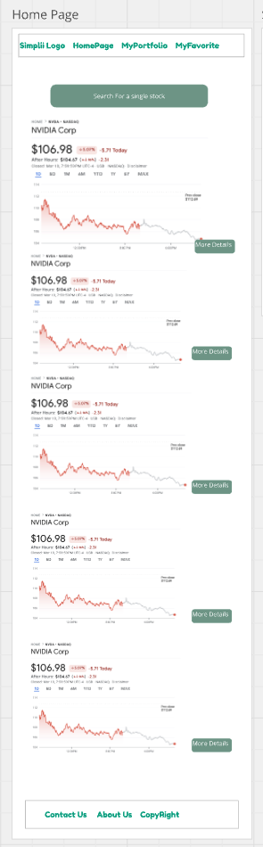
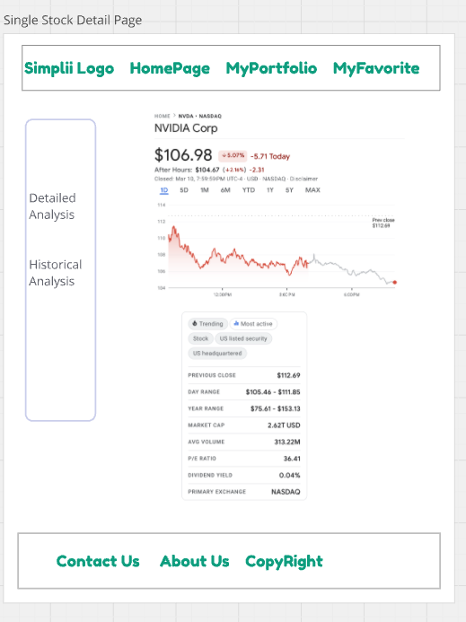
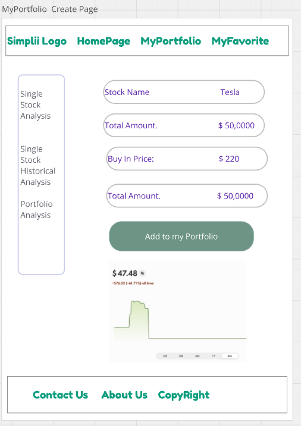
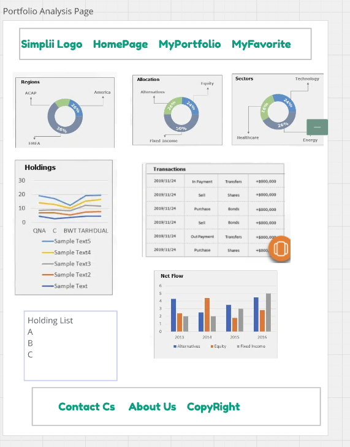
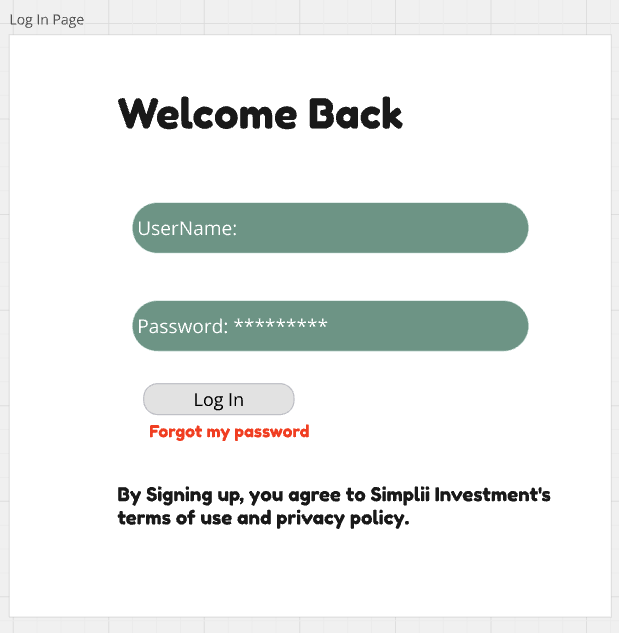
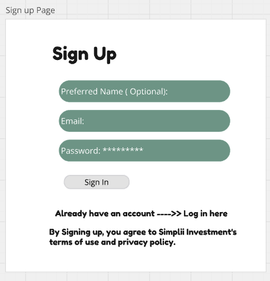
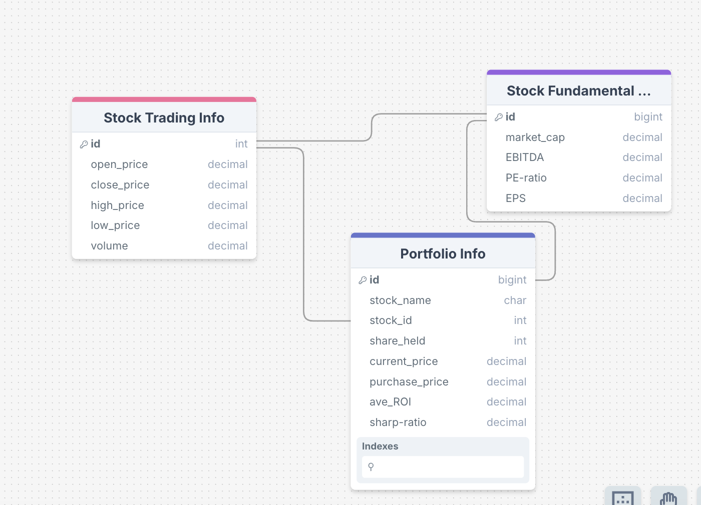

# castone-simplii-finance
# Project Title
Simplii Investment

## Overview

Simplii Investment is an investment portfolio dashboard to visualize investment performance, and it simulates investment data and provides key investment features. 

### Problem

Direct online investment has become popular and is replacing traditional method of going to a bank and letting a financial planner to do the investments for you. It can save commission fees and improve efficiency in managing our own investments. Trading and transactions can be completed via a variety of online brokers, such as Robinhood and WealthSimple. My goal is to build a toy version of these well-known investment applications, focusing on dashboard display. 

### User Profile

- Individual Investors who are looking for a visualized way of managing their investment portfolios and following stock market. 

### Features

- As a user, I want to be able to create an account to manage my investment portfolio.
- As a user, I want to be able to login to my account to manage my investment portfolio.
- As a logged in user, I want to be able to search for any stock I want to see. 
- As a logged in user, I want to be able to see the details and performance analysis of a single stock. (stock detail page).
- As a logged in user, I want to be able to input my portfolio stock name to generate my portfolio. 
- As a logged in user, I want to be able to see the performance metrics of my customized portfolio. 
- As a logged in use, I want to be able to see advanced visualizations. 
- As a logged in user, I want to be able to add stocks to my favorite stock list. 

## Implementation

### Tech Stack

- React
- JavaScript
- MySQL
- Express
- Client libraries: 
    - react
    - react-router
    - axios
- Server libraries:
    - knex
    - express
    - bcrypt for password hashing

### APIs

- Alpha Vantage: https://www.alphavantage.co/

### Sitemap

- Home Page ( Favorite stocks)
- Stock Detail Page 
- Portfolio Creating Page
- Portfolio Analysis Page
- Signup Page
- Login Page


### Mockups

#### Home Page


#### Single Stock Detail Page


#### MyPortfolio Create Page


#### MyPortfolio Analysis Page


#### Login Page


#### Sign Up Page


#### Data

###

Data Structure:
1. Data 

### Endpoints

Get stocks: (fetching from API)

- Get the single stock get/stock/:id


Endpoint 1: url = 'https://www.alphavantage.co/query?function=TIME_SERIES_INTRADAY&symbol=IBM&interval=5min&apikey=demo'


Response:
[
   "2025-03-07 19:45:00": {
            "1. open": "261.2100",
            "2. high": "261.5399",
            "3. low": "261.2100",
            "4. close": "261.2500",
            "5. volume": "9"
        },
        "2025-03-07 19:40:00": {
            "1. open": "261.2500",
            "2. high": "261.2500",
            "3. low": "261.2000",
            "4. close": "261.2000",
            "5. volume": "24"
        },
]

Endpoint 2: url = 'https://www.alphavantage.co/query?function=OVERVIEW&symbol=IBM&apikey=demo'
[
    {

    "MarketCapitalization": "242516640000",
    "EBITDA": "10442000000",
    "PERatio": "40.8",
    "PEGRatio": "1.786",
    "BookValue": "29.48",
    "DividendPerShare": "6.67",
    "DividendYield": "0.0255",
    "EPS": "6.41",
    }
]


Create portfolio (local database, local server)


** POST/portfolio/:id


Parameters:
- id: portfolio id

Response:
[
{
    "stock name": 
    "stock id": 
    "shared held": 
    "current price": ,
    "purchase price":
    "average ROI":
    "sharp ratio":
},
...
]

** Put/portfolio/:id
** Delete/portfolio/:id
** Put/portfolio/:id

POST/users/account

- Add a user account

Parameters:

- Email: User's email
- Password: User's provided password

Response:
{
    "token": "seyJhbGciOiJIUzI1NiIsInR5cCI6IkpXVCJ9.eyJzdWIiOiIxMjM0NTY3ODkwIiwibmFtZSI6I..."
}


POST/users/login
- Login a user

Parameters:
- email: User's email
- password: User's provided password

Response:
```
{
    "token": "seyJhbGciOiJIUzI1NiIsInR5cCI6IkpXVCJ9.eyJzdWIiOiIxMjM0NTY3ODkwIiwibmFtZSI6I..."
}
```

### Auth

- JWT auth
    - Before adding auth, all API requests will be using a fake user with id 1
    - Added after core features have first been implemented
    - Store JWT in localStorage, remove when a user logs out
    - Add states for logged in showing different UI in places listed in mockups

## Roadmap

- Create client
    - react project with routes and boilerplate pages

- Create server
    - express project with routing, with placeholder 200 responses

- Create migrations

- Fetch Endpoint 1
- Fetch Endpoint 2

- Create local database for MyPortfolio containing 7 key attributes

- Deploy client and server projects so all commits will be reflected in production

- Feature: Single Stock Search
    - Create input field
    - Create 2 get endpoints and fetch data

- Feature: Stock detail page
    - Fetching single stock data
    - Show Stock Details & Performance Analysis
        - Stock Name & Ticker
        - Current Price
        - Percentage Change
        - Market Capitalization
        - Dividend Yield
        - 52-Week High/Low
        
    - Render the elements
   

- Feature: Portfolio create page
    - Add form input for user to input their portfolio details (stock name and stock shares )
    - Create POST /portfolio

- Feature: Portfolio visualization page
  - Performance Metrics Calculation
    - Total Portfolio Value 
    - Return on Investment (ROI) 
    - Volatility (Standard Deviation of Returns)
    - Sharpe Ratio (Risk-Adjusted Return)
    - Portfolio Diversification (Sector Allocation)
  - Advanced visualization
   - Line chart:  Tracks portfolio value over time
   - Bar Chart: Compares performance of individual stocks
   - Pie Chart: Shows portfolio allocation by stock or sector
    

- Feature: Home page(My Favoriate stocks )
 - Create local db for storing favoriate stocks
  

- Feature: Create account
    - Implement register page + form
    - Create POST /users/register endpoint

- Feature: Login
    - Implement login page + form
    - Create POST /users/login endpoint

- Feature: Implement JWT tokens
    - Server: Update expected requests / responses on protected endpoints
    - Client: Store JWT in local storage, include JWT on axios calls

- Bug fixes

- DEMO DAY

## Nice-to-haves

- Page can automatically refresh when the user reopen the page without need to refresh
- Portfolios comparison functionality
- Link to online broker to actually purchase stocks
- Forgot password functionality
- Unit and Integration Tests